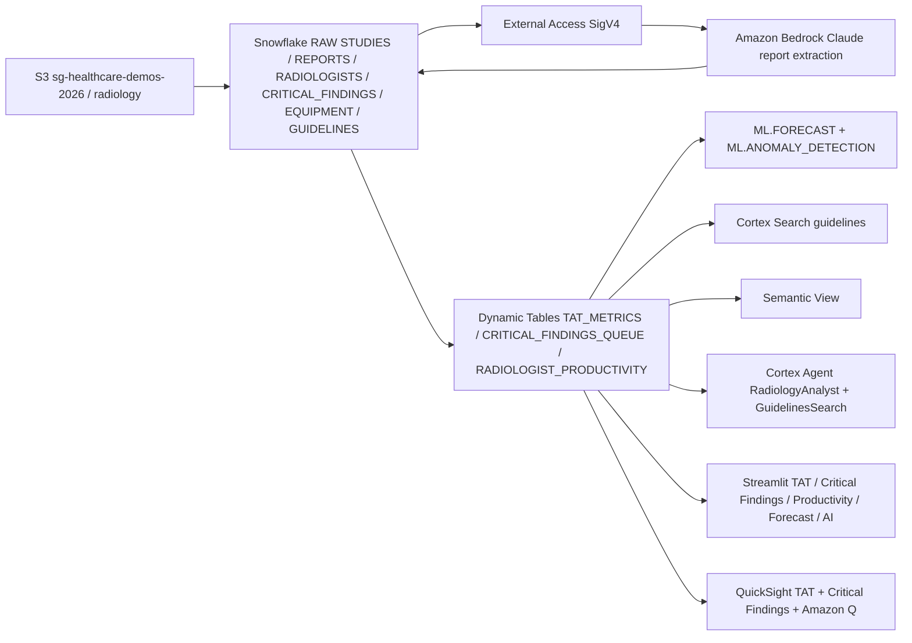

# Radiology Analytics & Medical NLP

End-to-end healthcare radiology analytics platform — turnaround time monitoring, critical findings management, AI-powered report extraction, and ML forecasting for capacity planning.

## Architecture

A radiology analytics and medical NLP platform built on **Snowflake** (Dynamic Tables, ML.FORECAST, ML.ANOMALY_DETECTION, Cortex Search, semantic view, Cortex Agent) and **AWS** (S3, Bedrock Claude, QuickSight + Amazon Q). Studies and reports land in S3; Bedrock extracts critical findings; Snowflake monitors TAT, productivity, and forecasts modality volume.



## Personas

| Persona | Role | Key Questions |
|---------|------|---------------|
| **Dr. Tanaka** | Chief Radiologist — oversees 50 radiologists | "Which modalities are breaching SLA?" "Show unacknowledged critical findings." |
| **Hospital COO** | Operations executive — tracks department KPIs | "Forecast CT volume next 30 days." "Which radiologists are below productivity targets?" |

## Data

| Table | Rows | Description |
|-------|------|-------------|
| STUDIES | 50,000 | Radiology studies across CT, MRI, X-Ray, Ultrasound, PET |
| REPORTS | 44,000 | Structured radiology reports with findings |
| RADIOLOGISTS | 50 | Named readers (Dr. Tanaka, Dr. Patel, Dr. Smith, etc.) |
| CRITICAL_FINDINGS | 3,000 | Urgent findings requiring acknowledgment |
| EQUIPMENT | 30 | Scanners and imaging devices |
| RADIOLOGY_GUIDELINES | 80 | Clinical guidelines for Cortex Search |

## Build Instructions

### Prerequisites
- Snowflake account with ACCOUNTADMIN access
- Cortex AI enabled (ML Functions, Search, Agent)
- Warehouse: CORTEX (Medium)
- AWS CLI with Bedrock, QuickSight access

### Deployment

```bash
snowsql -f snowflake/00_setup.sql
snowsql -f snowflake/01_integrations.sql
snowsql -f snowflake/02_raw_tables.sql
snowsql -f snowflake/03_curated.sql
snowsql -f snowflake/04_search.sql
snowsql -f snowflake/05_ml.sql
snowsql -f snowflake/06_semantic.sql
snowsql -f snowflake/07_agent.sql
snowsql -f snowflake/08_ai_extraction.sql
```

### Streamlit App
```
HEALTHCARE_RADIOLOGY.APP.RADIOLOGY_ANALYTICS_APP
```

## Key Demo Numbers

- **CT turnaround** averages 285 minutes (SLA is 120 minutes)
- **847 critical findings** unacknowledged
- **Dr. Tanaka** — 45 reads/day (top performer)
- **ML forecast** justifies hiring 3 additional radiologists

## License

Apache 2.0 — See [LICENSE](LICENSE) for details.
