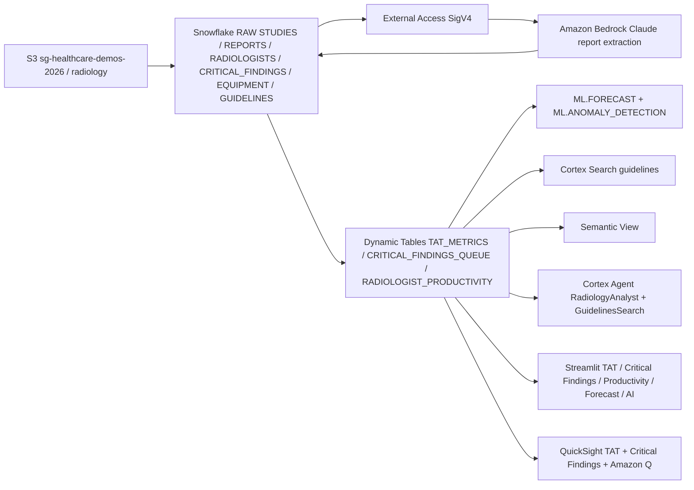

# Radiology Analytics & Medical NLP

End-to-end healthcare radiology analytics platform built on Snowflake, demonstrating turnaround time monitoring, critical findings management, AI-powered report extraction, and ML forecasting.

## Architecture

A radiology analytics and medical NLP platform built on **Snowflake** (Dynamic Tables, ML.FORECAST, ML.ANOMALY_DETECTION, Cortex Search, semantic view, Cortex Agent) and **AWS** (S3, Bedrock Claude, QuickSight + Amazon Q). Studies and reports land in S3; Bedrock extracts critical findings; Snowflake monitors TAT, productivity, and forecasts modality volume.




## Personas

| Persona | Role | Key Questions |
|---------|------|---------------|
| **Chief Radiologist** | Dr. Tanaka — oversees 50 radiologists, monitors TAT SLAs, manages critical findings | "Which modalities are breaching SLA?" "Show unacknowledged critical findings." "What does the guideline say about contrast protocols?" |
| **Hospital COO** | Operations executive — tracks department KPIs, forecasts capacity, identifies bottlenecks | "Forecast CT volume next 30 days." "Which radiologists are below productivity targets?" "Are there anomalies in our TAT trends?" |

## Data Scale

| Table | Rows | Description |
|-------|------|-------------|
| STUDIES | 50,000 | Radiology studies across CT, MRI, X-Ray, Ultrasound, PET |
| REPORTS | 44,000 | Structured radiology reports with findings |
| RADIOLOGISTS | 50 | Named readers (Dr. Tanaka, Dr. Patel, Dr. Smith, etc.) |
| CRITICAL_FINDINGS | 3,000 | Urgent findings requiring acknowledgment |
| EQUIPMENT | 30 | Scanners and imaging devices |
| RADIOLOGY_GUIDELINES | 80 | Clinical guidelines for Cortex Search |

## Capabilities

1. **Turnaround Time Monitoring** — Real-time TAT by modality with SLA breach detection (CT averages 285min vs 120min SLA)
2. **Critical Findings Queue** — 847 unacknowledged critical findings prioritized by severity and age
3. **AI Report Extraction** — Cortex COMPLETE extracts structured findings (anatomy, severity, recommendations) from free-text reports
4. **Productivity Analytics** — Per-radiologist daily reads and TAT (Dr. Tanaka: 45 reads/day)
5. **ML Forecast** — Time-series forecast of TAT by modality for capacity planning
6. **Anomaly Detection** — Automated detection of unusual TAT spikes across modalities
7. **Guidelines Search** — Cortex Search over 80 radiology clinical guidelines
8. **Conversational Agent** — Red-themed Cortex Agent combining analyst + search tools

## Demo Narrative

The demo centers on **CT turnaround time crisis**: CT studies average 285 minutes (SLA is 120 minutes), with 847 critical findings unacknowledged. The Chief Radiologist uses the agent to investigate root causes, discovering that evening shift coverage is insufficient and specific scanners have higher failure rates. The COO uses ML forecasts to justify hiring 3 additional radiologists and adding a second CT scanner, projecting ROI through reduced SLA breaches.

## Build Instructions

```bash
# Prerequisites: Snowflake account with ACCOUNTADMIN, AWS account with S3/Bedrock/QuickSight

# 1. Deploy Snowflake objects (run in order)
snowsql -f snowflake/00_setup.sql
snowsql -f snowflake/01_integrations.sql
snowsql -f snowflake/02_raw_tables.sql
snowsql -f snowflake/03_curated.sql
snowsql -f snowflake/04_search.sql
snowsql -f snowflake/05_ml.sql
snowsql -f snowflake/06_semantic.sql
snowsql -f snowflake/07_agent.sql
snowsql -f snowflake/08_ai_extraction.sql

# 2. Deploy QuickSight resources
chmod +x quicksight/deploy.sh
./quicksight/deploy.sh

# 3. Deploy Streamlit app
snow streamlit deploy --database HEALTHCARE_RADIOLOGY --schema APP
```

## Tear Down

```bash
# Remove AWS resources
chmod +x aws/teardown.sh
./aws/teardown.sh

# Remove Snowflake objects
snow sql -q "DROP DATABASE IF EXISTS HEALTHCARE_RADIOLOGY CASCADE;"
```

## License

Apache 2.0
